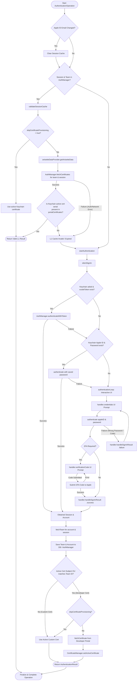

#### DESIGN DOCUMENTATION

1. Authentication:

```mermaid
graph TD
    Start([Start AuthenticationOperation]) --> CheckEmailChanged{Apple ID Email Changed?}
    CheckEmailChanged -- Yes --> ClearCache[Clear Session Cache]
    CheckEmailChanged -- No --> CheckL1Cache{Session & Team in AuthManager?}
    ClearCache --> CheckL1Cache

    %% L1 Path: Detailed validateSessionCache Sub-Flow
    CheckL1Cache -- Yes --> ValidateCache[validateSessionCache]
    ValidateCache --> CheckSkipCertProvisioning{skipCertificateProvisioning = true?}

    CheckSkipCertProvisioning -- Yes --> UseCachedCertDirectly[Use active Keychain certificate]
    UseCachedCertDirectly --> ReturnValidCache([Return Valid L1 Result])

    CheckSkipCertProvisioning -- No --> FetchAnisetteData[anisetteDataProvider.getAnisetteData]
    FetchAnisetteData --> FetchPortalCerts[AuthManager.fetchCertificates for team & session]

    FetchPortalCerts -- Success --> CheckActiveCertOnPortal{Is Keychain active cert serial <br/> present in portalCertificates?}

    CheckActiveCertOnPortal -- Yes --> ReturnValidCache
    CheckActiveCertOnPortal -- No --> L1Invalid[L1 Cache Invalid / Expired]
    FetchPortalCerts -- "Failure (Auth/Network Error)" --> L1Invalid

    %% L2 Path (startAuthentication)
    CheckL1Cache -- No --> StartAuth[startAuthentication]
    L1Invalid --> StartAuth

    %% Step 1: Silent Sign-In Attempts
    StartAuth --> SilentAuth[silentSignIn]
    SilentAuth --> CheckTokens{Keychain adsid & xcodeToken exist?}

    CheckTokens -- Yes --> TokenAuth[AuthManager.authenticateWithToken]
    TokenAuth -- Success --> GotSession[Obtained Session & Account]
    TokenAuth -- Failure --> CheckPassword

    CheckTokens -- No --> CheckPassword{Keychain Apple ID & Password exist?}
    CheckPassword -- Yes --> PasswordAuth[authenticate with saved password]
    PasswordAuth -- Success --> GotSession
    PasswordAuth -- Failure --> AuthLoop

    CheckPassword -- No --> AuthLoop[authenticationLoop: Interactive UI]

    %% Interactive Loop (UI Credentials + 2FA)
    AuthLoop --> RequestCreds[handler.credentials UI Prompt]
    RequestCreds --> CallAuth[authenticate appleID & password]

    CallAuth --> TwoFactorCheck{2FA Required?}
    TwoFactorCheck -- Yes --> Prompt2FA[handler.verificationCode UI Prompt]
    Prompt2FA -- Code Submitted --> Submit2FA[Submit 2FA Code to Apple]
    Submit2FA -- Success --> NotifyUI[handler.handleSignInResult .success]
    Submit2FA -- Error --> Prompt2FA

    TwoFactorCheck -- No --> NotifyUI
    NotifyUI --> GotSession

    CallAuth -- "Failure (Wrong Password / Code)" --> NotifyError[handler.handleSignInResult .failure]
    NotifyError --> RequestCreds

    %% Step 2 & 3: Unified Post-Auth Resolution
    GotSession --> FetchTeam[fetchTeam for account & session]
    FetchTeam --> SaveState[Save Team & Account to DB / AuthManager]

    SaveState --> CheckCustomCert{Active Cert Subject OU matches Team ID?}

    CheckCustomCert -- "No (Custom Cert)" --> ReuseCert[Use Active Custom Cert]
    CheckCustomCert -- "Yes (Developer Cert)" --> CheckSkipCert{skipCertificateProvisioning?}

    CheckSkipCert -- Yes --> ReuseCert
    CheckSkipCert -- No --> FetchCert[fetchCertificate from Developer Portal]
    FetchCert --> SaveActiveCert[CertificateManager.setActiveCertificate]

    ReuseCert --> FinishAuth([Return AuthenticationResult])
    SaveActiveCert --> FinishAuth
    FinishAuth --> FinalizeResult([Finalize & Complete Operation])
    ReturnValidCache --> FinalizeResult


```
